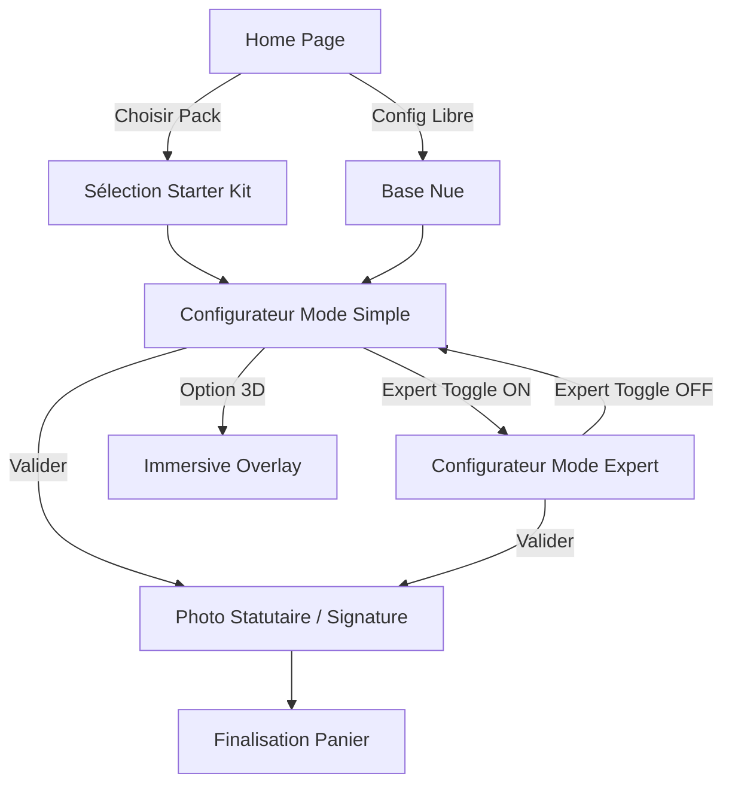

# UX Design Specification GameBoy_Builder

**Author:** Julien
**Date:** 2026-02-10

---

## Executive Summary

### Project Vision

Passer d'un outil purement technique à une plateforme de configuration "émotionnelle" et immersive nommée **RayBoy Modding**. L'accent est mis sur l'**acte de création** de la console de ses rêves, guidé par la simplicité (Packs) ou la précision (Expert), avec une esthétique Cyberpunk haute-lisibilité.

### Target Users

1. **Passionnés & Clients** : Cherchent à créer la Game Boy de leurs rêves, soit via un "Starter Kit" rapide, soit via une personnalisation pointue, pour ensuite passer commande auprès du moddeur.
2. **Visiteurs en Discovery** : Veulent voir l'évolution en 3D de leur configuration et comprendre instantanément le prix et les options.

### Key Design Challenges

- **Divulgation Progressive** : Offrir plus de 200 références sans surcharge cognitive par une hiérarchie claire Simple vs Expert.
- **Gestion du "Deck"** : Assurer une navigation fluide entre plusieurs configurations simultanées sans perdre l'état.
- **Accessibilité Néon** : Maintenir un ratio de contraste WCAG AA sur une interface Cyberpunk à haute intensité visuelle.

### Visual Foundation Refinements (from Mockups)

- **Aération (White Space)** : Nécessité d'augmenter les marges et l'espacement dans les vues complexes (Expert Sidebar) pour éviter un sentiment de surcharge.
- **Simplification du Recap** : La vue récapitulative doit rester pragmatique et lisible, en évitant les schématics trop denses au profit d'une liste claire et illustrée.
- **Validation du Style HUD** : Confirmation de l'efficacité du combo Orbitron/Rajdhani et du Cyber Orange pour les actions critiques.

### Design Opportunities

- **Micro-interactions HUD** : Effets de scan, sons système "bit-crushed" lors de la validation.
- **Visualisation Thématique** : Présentation des configurations sous forme de fiches techniques Cyberpunk.

## Design System Foundation

### Design System Choice
**Tailwind CSS v4 (Themeable System)**

### Rationale for Selection
- **Vitesse & Réactivité** : Développement Mobile-First immédiat avec des utilitaires robustes.
- **Liberté Visuelle** : Contrôle total sur les bordures angulaires et les effets de glow néon.
- **Maintenabilité** : Système standard facile à faire évoluer pour le dashboard futur.

### Customization Strategy
- **HUD Library** : Composants Vue réutilisables (Boutons notched, Cartes d'options) utilisant des classes Tailwind.
- **Cyber-Tokens** : Palette spécifique (Deep Purple, Neon Orange, Matrix Green).
## Core User Experience

### Defining Experience

L'expérience est centrée sur **"L'Éveil de la Création"**. L'interaction clé est la synchronisation visuelle immédiate entre les choix techniques et le rendu 3D, permettant à l'utilisateur de composer un objet physique réel de manière virtuelle.

### Platform Strategy

- **Web-First Responsive** : Parité de fonctionnalités entre Desktop et Mobile. Interface "touch-friendly" avec une gestion intelligente de l'espace pour le rendu 3D sur petits écrans.
- **Branding "RayBoy Modding"** : Logo "RayBoy" dominant avec "Modding" subtilement intégré.

### Effortless Interactions

- **Visual Feedback Loop** : Mise à jour 3D et tarifaire instantanée.
- **Guided Path (Simple Mode)** : Parcours balisé pour les néophytes.
- **Persistent Cart** : Ajout au panier fluide pour préparer la future commande.

### Critical Success Moments

- **L'Instant "Vivant"** : Voir la console de ses rêves prendre vie en 3D.
- **La Clarté Totale** : Compréhension immédiate du récapitulatif d'options et du prix final.

### Experience Principles

1. **Clarté Opérationnelle** : Explication didactique des incompatibilités.
2. **Esthétique Plaisir** : L'interface Cyberpunk sert le plaisir de créer sans sacrifier la lisibilité.
3. **Friction Zéro** : Passage naturel de la configuration à la préparation de commande.

## Desired Emotional Response

### Primary Emotional Goals

- **Inspiration & Créativité** : L'utilisateur doit se sentir comme un enfant dans un magasin de jouets technologique. L'objectif est de lui donner le sentiment que son expérience Game Boy originale va être **magnifiée** par ses choix (écrans modernes, options de batterie, etc.).
- **Maîtrise Créative** : Le plaisir de voir une configuration complexe devenir simple et concrète devant ses yeux.

### Emotional Journey Mapping

- **Découverte (Packs)** : Curiosité et Surprise. "Ah, je savais pas qu'on pouvait faire ça !".
- **Création (Modding)** : Émotion de Flux. Concentration, facilité et sentiment de contrôle total (Expert mode).
- **Validation (Panier)** : Satisfaction et Accomplissement. "C'est MA console, elle est parfaite".

### Micro-Emotions

- **Confiance Artisanale** : Un sentiment très léger et subtil que la console est réalisée par un passionné qui "en prend soin". Pas de sur-promesse, juste une touche de professionnalisme artisanal.
- **Transparence** : Élimination de toute anxiété liée au prix ou à la compatibilité.

### Design Implications

- **Effets "Glow" & HUD** : Renforce le sentiment d'utiliser un outil futuriste de création.
- **Feedback Immédiat** : Évite la frustration en validant chaque choix instantanément.
- **Ton de Voix** : Professionnel, technique mais accessible, reflétant la passion du moddeur sans sentimentalisme excessif.

### Emotional Design Principles

1. **Magnification du Retro** : Chaque option doit être présentée comme une amélioration "Premium" de l'original.
2. **Clarté Calme** : L'interface doit rester épurée sur mobile et desktop pour éviter la surcharge émotionnelle négative (confusion).
3. **Plaisir Créatif Sans Barrière** : On encourage l'exploration (Expert mode toggle) sans jamais rendre l'erreur punitive.
## UX Pattern Analysis & Inspiration

### Inspiring Products Analysis

Bien que l'utilisateur privilégie la **simplicité brute** plutôt que des références spécifiques, nous nous inspirerons des patterns éprouvés de configurateurs "Direct-to-Consumer" :
- **Apple (Configurateur Mac/iPhone)** : Pour sa clarté chirurgicale dans la présentation des options et l'actualisation immédiate du prix.
- **LEGO Design-Lab / BrickLink** : Pour l'aspect ludique de la construction pièce par pièce.
- **Tesla** : Pour la fluidité de la transition entre les étapes et le rendu visuel dominant.

### Transferable UX Patterns

- **Vertical Stepper** : Une navigation verticale claire par catégories (Coque -> Écran -> Boutons) qui guide sans perdre l'utilisateur.
- **Floating Option Cards** : Des cartes simples avec image, prix et court texte pour une sélection rapide sur mobile.
- **Progressive Pricing** : Affichage constant du prix total qui "pulse" légèrement lors d'une mise à jour pour confirmer l'action.

### Anti-Patterns to Avoid

- **Overwhelming Technical Spec** : Éviter de lister des détails techniques inutiles dans le parcours "Simple".
- **Hidden Dependencies** : Ne jamais laisser l'utilisateur choisir une option incompatible sans explication immédiate (Glitch effect / Tooltip).
- **Navigation Multi-niveaux complexe** : Rester sur une hiérarchie plate pour garantir la rapidité d'accès souhaitée.

### Design Inspiration Strategy

- **Adopter** : La **Clarté Opérationnelle** d'un e-commerce moderne (Boutons "Ajouter au panier" évidents).
- **Adapter** : Le style **HUD Cyberpunk** (bordures notched) pour donner du caractère, mais sans sacrifier la lisibilité.
- **Éviter** : Les animations trop longues qui retardent l'acte de création.

## Defining Experience

### Defining Experience: "L'Atelier Visuel"
L'interaction clé est la **mise en avant immédiate des options choisies**. L'utilisateur voit sa console se construire à travers un récapitulatif dynamique et illustré. Le **mode 3D est une option** activable manuellement pour ceux qui souhaitent une immersion totale.

### User Mental Model: "Le Créateur Pragmatique"
L'utilisateur vient pour "faire sa console". Il veut voir ses choix s'empiler de manière logique et comprendre l'impact sur le prix et les fonctionnalités. Il cherche la simplicité d'un panier clair avant tout.

### Success Criteria
- **Clarté du Recap** : Chaque option ajoutée est visuellement confirmée dans un "panneau de configuration" central.
- **Tarification Transparente** : Mise à jour du prix en temps réel sans friction.
- **Accessibilité Mobile** : Navigation entre les options facilitée par des contrôles de grande taille.
## Design Direction Decision

### Design Directions Explored
Nous avons exploré 7 axes visuels majeurs via des mockups haute-fidélité :
1. **Hero Desktop** : Focus sur la console centrale.
2. **Mobile View** : Navigation "Touch-First".
3. **Pack Selection** : Mise en avant des Starter Kits.
4. **Recap Schematic** : Vue technique blueprint (retenue pour sa structure mais à simplifier).
5. **Expert Mode** : Interface dense (à aérer).
6. **UI Components** : Système de bordures notched et effets de glow.
7. **Unboxing Experience** : Immersion post-configuration.

### Chosen Direction
La direction **"Atelier Cyberpunk Immersif"** est validée. Elle combine la clarté opérationnelle des configurateurs modernes (Apple/Tesla) avec l'identité visuelle forte du HUD Cyberpunk.

### Design Rationale
- **Engagement Émotionnel** : Le style "Unboxing" et les effets de glow renforcent la perception de la console comme un objet précieux.
- **Expertise Technique** : L'utilisation de Rajdhani et Orbitron ancre le produit dans un univers de modding professionnel.
- **Flexibilité** : Le système Tailwind v4 permet d'ajuster l'aération demandée tout en conservant les éléments HUD complexes.

### Implementation Approach
- **Layout** : Structure flexible avec de larges marges ("Airy Cyberpunk") pour éviter la surcharge cognitive constatée sur le mockup Expert.
- **Récapitulatif** : Évolution vers une liste illustrée plus "digestible" que le schéma technique pur.
- **Animations** : Transitions fluides type "System Boot" pour l'entrée et les changements de catégories.

### Experience Mechanics
- **1. Initiation** : Choix d'un Pack ou d'une base nue.
- **2. Interaction** : Sélection fluide dans une liste d'options catégorisée.
- **3. Feedback** : Mise à jour instantanée du récapitulatif textuel/illustré. Les incompatibilités sont signalées par un effet de glitch léger ou un message clair.
- **4. Complétion** : Passage direct au panier pour valider la commande.
## User Journey Flows

### 1. "L'Entrée des Artistes" (Home -> Config)
L'utilisateur arrive sur une page d'accueil immersive et doit choisir son point d'entrée.
- **Flux** : Home -> [Carte Starter Kits] ou [Carte Atelier Libre] -> Initiation Configurateur.
- **Pattern** : Double-portail HUD avec prévisualisation thématique.

### 2. "L'Atelier Visuel" (Boucle de Création)
Cœur de l'application où l'utilisateur compose sa console.
- **Flux** : Navigation par catégories (Coque, Écran, Boutons) -> Recap Dynamique -> [Toggle Expert ON/OFF].
- **Mise en Scène** : Le récapitulatif central illustré et textuel est prioritaire. Le mode 3D est un "overlay" d'immersion optionnel.
- **Pattern** : Vertical Stepper + Floating Action Buttons pour la 3D.

### 3. "La Signature" (Validation -> Success)
Le moment de transition vers la possession.
- **Flux** : Validation Configuration -> **Mise en Scène Statutaire** -> Finalisation Panier.
- **Concept** : Présentation photographique de type "Chef d'œuvre" (photo statutaire), valorisant le savoir-faire et l'esthétique finale du produit sur un socle technique Cyberpunk (inspiré des visuels validés).
- **Pattern** : Full-screen Product Reveal avec éclairage dramatique et récapitulatif technique "Signature".

### Diagramme de Flux (Architecture Finale)

### Flow Optimization Principles
1. **Airy Cyberpunk** : Augmenter les marges (`p-8`, `gap-8`) pour garantir la clarté.
2. **Simplification du Recap** : Liste visuelle élégante plutôt que schéma dense.
3. **Progressive Disclosure** : Les détails techniques du mode Expert ne polluent pas l'interface Simple.

## Component Strategy

### Design System Components
Utilisation massive des utilitaires **Tailwind CSS v4** pour la mise en page, le glassmorphism et les effets de lueur.
- **Bases** : Conteneurs avec `backdrop-blur`, bordures `border-orange-500/50`.
- **Typo** : Classes utilitaires pour `Orbitron` (titres) et `Rajdhani` (UI).

### Custom Components
1. **RayBoy HUD Button** : Bouton biseauté (clip-path notched) avec bordure animée et effet de glow réactif.
2. **Technical Recap List** : Composant de liste "Airy" affichant les composants choisis avec une petite icône filaire et le prix néon.
3. **Expert Toggle HUD** : Interrupteur stylisé avec animation de glitch à l'activation.
4. **Signature Showcase** : Composant plein écran gérant la mise en scène lumineuse du rendu final (Statutory Photo style).

### Component Implementation Strategy
- **Atomic Design** : Boutons et Badges (Atomes) -> Menus HUD (Molécules) -> Configurateur (Organisme).
- **Réutilisabilité** : Tous les composants HUD sont isolés pour être utilisés dans le futur dashboard de commande.

### Implementation Roadmap
- **Phase 1** : Boutons notched, Menus Simple, Recap List de base.
- **Phase 2** : Toggle Expert, Navigation 3D Overlay.
- **Phase 3** : Signature Showcase, Animations "System Boot".
